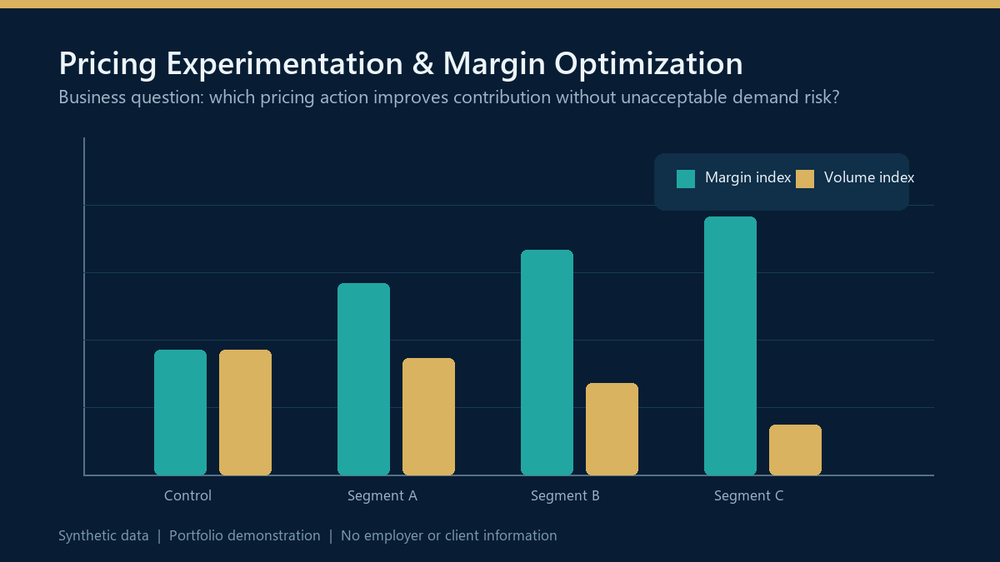

# Pricing Experimentation and Margin Optimization

> Executive decision-support portfolio project using synthetic data.

## Business objective

Help commercial and finance leaders evaluate pricing actions without treating margin improvement as a single-variable decision. The framework tests the relationship among price, customer response, volume, and contribution so leadership can distinguish a promising pricing move from a risky one.

## Executive questions supported

- Which customer segments are appropriate for a controlled pricing test?
- Does the observed change reflect the pricing action or an unrelated trend?
- How much demand risk accompanies the potential contribution improvement?
- What evidence is required before scaling a pricing decision?

## Decision logic

The notebook creates synthetic treatment and control groups, measures pre- and post-period behaviour, and applies statistical tests and Difference-in-Differences analysis. The objective is not to produce a universal price recommendation; it is to create a repeatable decision process with explicit evidence and guardrails.

## What the analysis produces

- Treatment and control performance comparison
- Segment-level margin and volume views
- Statistical significance testing
- Difference-in-Differences estimation
- Price-elasticity diagnostics
- A decision-ready summary of trade-offs and limitations

## Governance and privacy

This is a portfolio demonstration built entirely with synthetic data. It contains no employer, client, customer, product, pricing, or transaction information. All charts and outputs are illustrative rather than claims of realized business performance.

## Run the notebook

1. Install the packages in `requirements.txt`.
2. Open `Pricing_Experimentation_&_Margin_Optimization.ipynb`.
3. Run the notebook from top to bottom to reproduce the analysis and visuals.

## Technology and analytical methods

Python, pandas, NumPy, SciPy, statsmodels, matplotlib, seaborn, controlled experimentation, statistical testing, Difference-in-Differences, price elasticity.

---

Created by [Aftab Khan](https://www.linkedin.com/in/aftabparvezkhan/) as part of a finance, data, and AI decision-intelligence portfolio.
